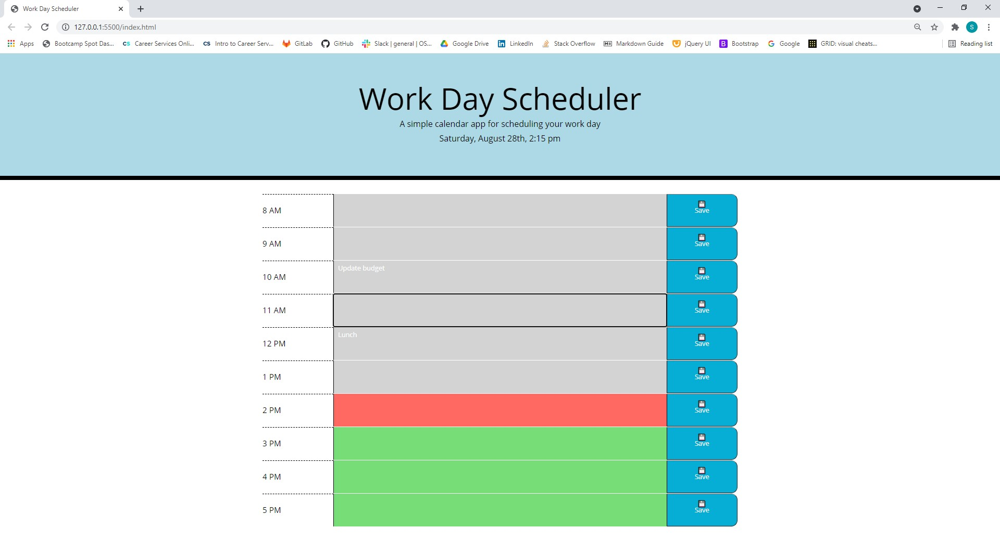

# Work Day Scheduler
Created by Shawn Miller

# Technologies Used
- HTML
- CSS
- Javascript
- Jquery
- Bootstrap
- FontAwesome
- moment().js

# Description
This website was made to create a work day scheduler. Inside this scheduler a user can input text into each hour block.  After the user data is entered the user can hit the save button to the right and the data will be saved to local storage.  If a user refreshes the page the data will pull from local storage for each time block.  Each time block text area will change color depending on the time of day.  The text area will be gray for time blocks in the past, red for the current hour and green for future time blocks.

# Appearance

# Known Bugs
No known bugs

## Contact info
shawnsmm@gmail.com